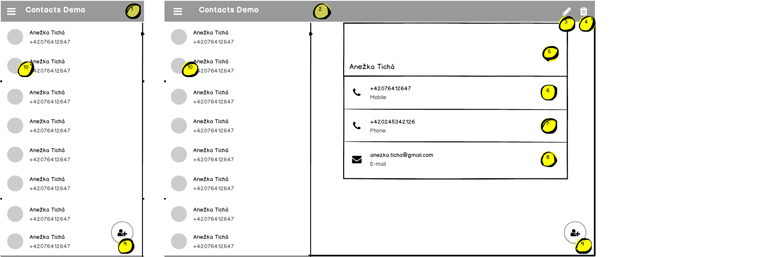

# Wireframes

This is mockup of Contacts Demo application.

## Main screen - list of contacts

This screen is shown when you enter the application. It's responsive on your screen width, it should display tablet mode (1) on wide screens and mobile mode (2) on smaller screens.
 

1. mobile view - it show only list of contacts, by clicking the list you can display the detail; name of application is shown in toolbar 
2. tablet view - it shows list on the left side and detail of current item on right side; name of application is shown in toolbar
3. edit button on toolbar - starts editing current displayed item
4. delete button on toolbar - deletes current displayed item, before deletion a confirmation dialog is shown
5. space for displaying contact's name and photo
6. space to display contact's cell phone number
7. space to display contact's fixed phone number
8. space to display contact's e-mail address
9. floating action button (FAB) to add new contact
10. item in the list contains contact's full name and phone number (cellular first, if both are available), also contact's photo thumbnail is shown

## Detail of contact - mobile view

It's displayed when you click on the contact in mobile mode view. It's same as on the main screen when displayed in tablet mode.

1. Title Detail is shown 
2. Up button navigates back to the main screen
3. edit button on toolbar - starts editing current displayed item
4. delete button on toolbar - deletes current displayed item, before deletion a confirmation dialog is shown

## Adding or editing the contact

It's started in edit mode with title "Edit contact" when you press edit icon (3 on the detail), or in new contact mode when you press FAB button on the main screen (9 on the main screen).
When started in edit mode, it loads current's contact data.

1. Up button on toolbar navigates back to the main screen
2. Input field for first name, it's required field
3. Input field for last name, it's required field
4. Input field for cellular phone number, it's not mandatory, but it's checked on correct phone number format
5. Input field for fixed phone number, it's not mandatory, but it's checked on correct phone number format
6. Input field for e-mail, it's not mandatory, but it's checked on correct e-mail address format
7. Save button - when you press it, current contact is saved if the form is valid and you will be redirected on the detail of the new/updated contact. If it's invalid, error dialog is shown with error description. 

 